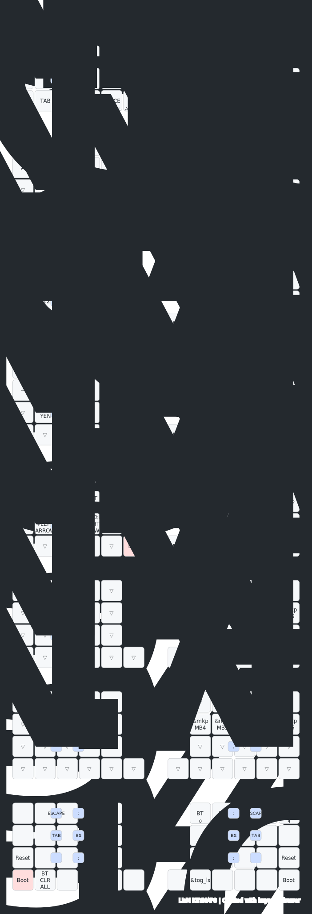

# LisM キーボード ファームウェア

[](https://opensource.org/licenses/MIT)

自作キーボード LisM のファームウェアです。

## 概要

| 項目 | 内容 |
|------|------|
| キーボード | LisM（分割キーボード） |
| キー数 | 42キー |
| MCU | Seeeduino XIAO BLE (nRF52840) |
| 接続 | Bluetooth |
| 左手側 | 水平ロータリーエンコーダ |
| 右手側 | PAW3222 トラックボール |
| ZMK Studio | 対応（別ビルド） |

## 書き込み方法

ファームウェアを書き換えるには、キーボードを「ブートローダーモード」で起動し、PCに接続する必要があります。

### ブートローダーモードへの入り方

1. USBケーブルで書き込みたい側のキーボードをPCに接続する
2. **反対側**のキーボードの外側1番下のキーを押しながら、**書き込みたい側**のキーボードの外側1番下のキーを押す
3. `XIAO-SENSE` というドライブがPCに表示される

### ファームウェアファイルをコピーする

`.uf2` 形式のファームウェアファイルを、表示された `XIAO-SENSE` ドライブにドラッグ＆ドロップでコピーします。
コピーが完了すると、キーボードは自動的に再起動します。

- 左側: `lism_left_peripheral_non_trackball.uf2`
- 右側: `lism_right_central_trackball.uf2`

> [!NOTE]
> キーマップのみの変更であれば右側（Central）のファームウェアだけ書き込めばOKです。

## 生成されるファームウェア一覧

| ファームウェア名 | 説明 |
|------|------|
| `lism_left_peripheral_non_trackball.uf2` | 左側 ペリフェラル・エンコーダ ★現構成 |
| `lism_left_peripheral_trackball.uf2` | 左側 ペリフェラル・トラックボール |
| `lism_right_central_non_trackball.uf2` | 右側 セントラル・エンコーダ |
| `lism_right_central_trackball.uf2` | 右側 セントラル・トラックボール ★現構成 |
| `lism_right_central_non_trackball_studio.uf2` | 右側 セントラル・エンコーダ（ZMK Studio 対応） |
| `lism_right_central_trackball_studio.uf2` | 右側 セントラル・トラックボール（ZMK Studio 対応） |
| `settings_reset-seeeduino_xiao_ble-zmk.uf2` | 設定リセット用 |

## ローカルビルド手順

### 必要なもの

- [Visual Studio Code](https://code.visualstudio.com/)
- [Docker Desktop](https://www.docker.com/products/docker-desktop/)
- VS Code拡張機能: [Dev Containers](https://marketplace.visualstudio.com/items?itemName=ms-vscode-remote.remote-containers)

### 手順

1. **準備**
   1. このリポジトリをPCにcloneします。
   2. Docker Desktopを起動します。
   3. VS Codeでこのフォルダを開きます。
   4. 右下に表示される「Reopen in Container（コンテナーで再度開く）」をクリックします。
      （初回は環境構築に時間がかかります）

2. **ビルド（ファームウェア作成）**

   > [!TIP]
   > ビルドはCPUコアを最大限に活用して並列実行できます。環境変数 `PARALLEL` で並列数を指定できます（例: `PARALLEL=4 make`）。

   | コマンド | 説明 |
   |---|---|
   | `make` | 全ファームウェアを並列ビルド（Studio除く） |
   | `make all_studio_p` | Studio含む全ファームウェアを並列ビルド |
   | `make single` | ビルド対象をインタラクティブに選択 |
   | `make clean` | ビルド成果物を全削除 |

3. **完成**
   ビルドが完了すると `firmware_builds/` フォルダに `.uf2` ファイルが生成されます。

### 依存関係の更新

ZMK本体や依存モジュールを更新する場合:

```bash
git pull
make setup-west
```

## 依存モジュール

| モジュール | 説明 |
|---|---|
| [ZMK Firmware](https://github.com/zmkfirmware/zmk) | ZMK本体（v0.3.0） |
| [zmk-driver-paw3222](https://github.com/sekigon-gonnoc/zmk-driver-paw3222) | PAW3222 トラックボールドライバー |
| [zmk-rgbled-widget](https://github.com/caksoylar/zmk-rgbled-widget) | RGB LED ウィジェット |
| [zmk-feature-charge-indicator](https://github.com/4mplelab/zmk-feature-charge-indicator) | 充電インジケータ |
| [zmk-layout-shift](https://github.com/kot149/zmk-layout-shift) | JIS配列対応モジュール |

## JIS配列対応

[zmk-layout-shift](https://github.com/kot149/zmk-layout-shift) を使用してJIS配列に対応しています。

OSがJIS配列に設定されている場合でも、記号キーが正しく入力されます。

### JIS/US配列の切り替え

DEVICE レイヤー（Layer 7）に `tog_ls`（Toggle Layout Shift）を割り当てています。

| 状態 | 説明 |
|------|------|
| Layout Shift OFF | US配列として動作（デフォルト） |
| Layout Shift ON | JIS配列として動作 |

OSの設定がJIS配列の場合は `tog_ls` を押してLayout Shiftを有効にしてください。状態はフラッシュに永続保存されます。

## Bluetooth プロファイルによる OS レイヤー自動切替

接続先の Bluetooth プロファイルに応じて、WIN / MAC レイヤーが自動的に切り替わります。

| プロファイル | レイヤー | 想定用途 |
|---|---|---|
| 0, 2, 4 | MAC（Layer 1） | macOS 端末 |
| 1, 3（その他） | WIN（Layer 0） | Windows 端末 |

プロファイルを切り替えるだけで修飾キー（Ctrl / Cmd）のマッピングが自動で変わるため、手動でレイヤーを切り替える必要はありません。

## Auto Mouse Layer

トラックボールを動かすと自動的にMOUSEレイヤー（Layer 5）が有効になります。

| 設定 | 値 | 説明 |
|------|-----|------|
| タイムアウト | 10秒 | 操作がないと自動で解除 |
| 誤爆防止 | 200ms | キー入力直後のカーソル移動では発動しない |
| 除外キー | マウスボタン | マウスボタンを押してもレイヤーは解除されない |

## Mod-Tap / Layer-Tap 設定

`&mt`（mod-tap）と `&lt`（layer-tap）に以下の設定を適用しています。

| 設定 | 値 | 説明 |
|------|-----|------|
| flavor | balanced | ホールド/タップの判定方式 |
| quick-tap-ms | 150ms | 連続タップ時に即タップとして認識する間隔 |
| require-prior-idle-ms | 150ms（`&mt` のみ） | 直前のキー入力から一定時間後にホールドを認識 |

- **balanced**: 他のキーを押すとホールド、離すとタップとして判定
- **quick-tap-ms**: 素早い連続入力（例: "aa"）がしやすくなる

## セントラル／ペリフェラルの入れ替え

LisM は左右どちらでも「セントラル（Central）」と「ペリフェラル（Peripheral）」を選べます。
既定は右セントラルですが、左セントラル構成も用意できます。

1. `build.yaml` の「Central = Left」ブロックを有効化
2. `build.yaml` の「Central = Right」ブロックを無効化
3. ビルドして書き込み

## Keymap


